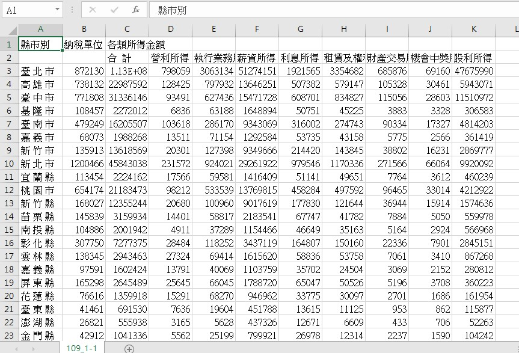

# tax
### 資料源
-pdf：建議使用[tabulate](https://pypi.org/project/tabulate/)將所有PDF轉存為csv，即可用pandas處理資料，但表頭會因為合併儲存格而亂掉，所以需要搭配**109年度綜合所得稅申報初步核定統計專冊**參考，但數據部份則不受影響，如下圖。

-html：(不建議)用爬蟲的方式去爬取每個html的表格，全部約5XX多張表，格式不完全一致。
### 說明
[109年度綜合所得稅申報初步核定統計專冊](./data/html/ISA109.html)
請參考表名對照檔名的結構說明。

### 參考來源
[財政部財政資訊中心](https://www.fia.gov.tw/singlehtml/43?cntId=17dcd598b9fd41939cf98c2e4ae162fd)
